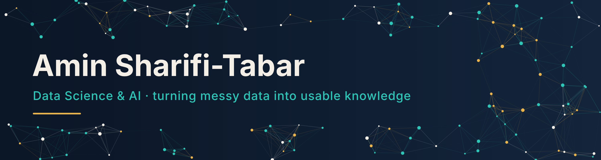

### Hi, I'm Amin

I build AI and data products that turn messy data into knowledge people can actually use, from data pipelines and ML models to the dashboards and interfaces on top.

- Data Science & AI student at **Hochschule Düsseldorf** (DAISY)
- AI Solutions Expert at **Trusted Shops**, working on AI enablement and chatbot optimisation
- Founder and chair of **[Düsseldorfer Hochschul Consulting e.V.](https://d-h-consulting.de/)**, Germany's first AI-focused student consultancy
- Based in Düsseldorf, Germany

### Featured work

| Project | What it is | Stack |
|---|---|---|
| **[Paradise under Pressure](https://github.com/sorassword/paradise-under-pressure)** ([live](https://sorassword.github.io/paradise-under-pressure/)) | Interactive 3D globe telling the story of Pacific island nations: tourism, ocean warming, emissions and natural disasters | Three.js, JavaScript |
| **[AI Sales Dashboard](https://github.com/sorassword/ai-sales-dashboard)** | Retail analytics showing how usage of an AI sales assistant relates to revenue (anonymised client prototype) | FastAPI, SvelteKit 5, TypeScript |
| **[Air-Writing Recognition](https://github.com/sorassword/gesture-recognition-hmm)** | Draw letters in the air and the webcam recognises them in real time, 92 % accuracy | MediaPipe, HMM, Python |
| **[Particle Life](https://github.com/sorassword/particle-life)** ([demo](https://huggingface.co/spaces/41yannik/particle-life)) | Emergent behaviour from a single force matrix, physics sped up 127x with spatial hashing and Numba | NumPy, Numba, Vispy |

### Tech I work with

### Currently

Helping small and mid-sized companies find and implement sensible AI use cases with DHC.

### Contact

[LinkedIn](https://www.linkedin.com/in/arian-sharifi-tabar-a71682393/) · [Düsseldorfer Hochschul Consulting](https://d-h-consulting.de/)
